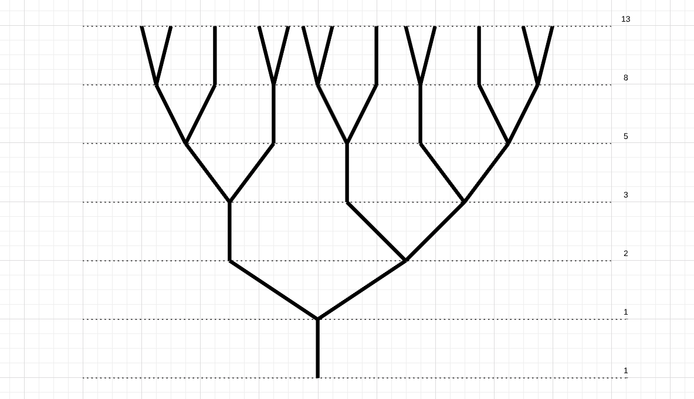

# Fibonatree

-WORK IN PROGRESS-

## The goal:

To simulate a plant's growth, with the help of Python and Fibonacci.

## Requirements:

- Tree consists of branches

- Each branch is either a normal "single" branch:

- Or is split into two:

- The total number of branches after each "generation" equals the following number in the Fibonacci Sequence

- Each individual branch and its resulting "sub-branches" will also follow the Fibonacci pattern
